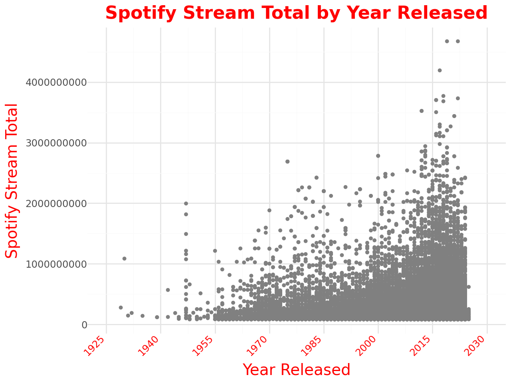

# Project3

## **Table of Contents**

- [Project3](#project3)
  - [**Table of Contents**](#table-of-contents)
  - [**Project Overview**](#project-overview)
  - [**Features**](#features)
  - [**Technologies / Dependencies Needed and Used**](#technologies--dependencies-needed-and-used)
  - [**How to Run the Application**](#how-to-run-the-application)
  - [**Visualizations**](#visualizations)
  - [**Visualization Details**](#visualization-details)
  - [**Visualization Details**](#visualization-details-1)
  - [**Data Source**](#data-source)
  - [**Team Responsibilities**](#team-responsibilities)
  - [**Sources**](#sources)
  - [**Additional Information**](#additional-information)
  - [**License**](#license)
  - [**Project By**](#project-by)
  - [**Contact**](#contact)

## **Project Overview**
<br>
&nbsp;&nbsp;&nbsp;&nbsp;The aim of our project is to look at the change in popularity of music genres across the years of 2015 to 2024. The data we will be working with is Spotify track streams. We will be looking at the number of total streams a genre has on spotify. To do this we will first divide the tracks into years they were released. We will then get the genre of each track within and divide the tracks into the genre they belong to. Finally we will add all the number of track streams within a given genre and year and compare those to other genres within the same year. 


## **Features**
* Something here
* Something here
* Interactive Map: Something here
* 1. Part 1 of interactive diagram can be found here [Github Pages maybe???](group github page)
* 2. Part 2 of interactive diagram if needed can be found here [Github Pages maybe Part 2](group github page)

## **Technologies / Dependencies Needed and Used**
- **Pandas**: Used for handling and analyzing large datasets, particularly in tabular form (e.g., DataFrames).
- **SQL**: Used for managing and querying relational databases. It allows you to retrieve, update, and manage data stored in a structured format.
- **PostgreSQL**: A relational database management system (RDBMS) used for storing and querying structured data. It provides support for advanced SQL queries and is widely used in production environments for managing databases.
- **re**: The regular expression (regex) library in Python. It provides a way to search for patterns in text, making it useful for text processing and data cleaning tasks.
- **defaultdict**: A subclass of Python's built-in `dict` that provides a default value for missing keys. It helps simplify handling missing keys during data manipulation.
- **tabulate**: A library used for creating well-formatted plain-text tables. It is helpful for presenting data in a readable format when working with outputs from Python scripts.
- **plotnine**: A data visualization library in Python based on the grammar of graphics. It is used for creating static, high-quality plots and charts.
- **nbformat**: A library for reading and writing Jupyter notebook files (`.ipynb`). It is used for programmatically working with Jupyter notebooks, especially for parsing or manipulating notebook content. (For whatever reason, we needed this)
* **SQLiteStudio**: Used to Ctcreate and modify SQLite databases without needing to write complex SQL commands. rowse and edit tables, views, and indexes. Execute SQL queries and scripts directly from the interface. Export data and generate SQL code for table structures and data.
*  **SQLite3**: Used for applications that need to store structured data locally without requiring a separate server or complex setup. It operates as a self-contained, serverless, zero-configuration database engine.
*  **Plotly**: Plotly's Python is a graphing library that makes interactive, publication-quality graphs. Examples of how to make line plots, scatter plots, area charts, bar charts, error bars, box plots, histograms, heatmaps, subplots, multiple-axes, polar charts, and bubble charts.
*  **JSON**:  Is a widely-used text-based format for data interchange. Used to effectively handle JSON data.


## **How to Run the Application**
add here

## **Visualizations**
<div style="display: flex; justify-content: space-between;">
    
    
</div>

[Github Pages Interactive map 1](https://miltonluke.github.io/Project3/html/spotify_stream_total_plot.html)

[Github Pages Interactive plot 1](https://miltonluke.github.io/Project3/html/12plot_spotify_stream_total_1990_2025.html)

[Github Pages Interactive plot 2](https://miltonluke.github.io/Project3/html/12plot_spotify_stream_total_2015_2025.html)

[Github Pages Interactive plot 3](https://miltonluke.github.io/Project3/html/spotify_rock_streams_by_year.html)

[Github Pages Interactive plot 4](https://miltonluke.github.io/Project3/html/spotify_pop_streams_by_year.html)

[Github Pages Interactive plot 5](https://miltonluke.github.io/Project3/html/spotify_Hip_Hop_streams_by_year.html)

[Github Pages Interactive plot 6](https://miltonluke.github.io/Project3/html/spotify_genre_streams_by_year_grouped.html)

[Sample use of the Tabulate library](https://miltonluke.github.io/Project3/images/sample_tabulate.png)

## **Visualization Details**
- A drop down that displays a bar graph that lists genre and track plays in a given year.
- A drop down displays a line graph that tracks plays per genre across all the relase years of 2015 to 2024.

## **Visualization Details**
- Spotify info
## **Data Source**
  - Soundcharts (See "Additional Information" on How Spotify and Streaming  are Measured here) [**Additional Information**](#additional-information)

## **Team Responsibilities**
- Lynn: Working on creating the PowerPoint presentation that will be given to the class.
- Matt: Matt is cleaned up the data from csv file. Using regex to pull out the genre names.
- Dylan: Setting up the sql and postgress for the data. Working on cleaing csv’s.


## **Sources**
* [Soundcharts](https://app.soundcharts.com/app/market/tracks?filters=eyJzIjoiYXVkaWVuY2Uuc3BvdGlmeXxkZXNjfG1vbnRofHRvdGFsIiwiZiI6eyJmYyI6IkFMTF9DT1VOVFJJRVMiLCJmdHNnIjoiQUxMX0dFTlJFUyJ9LCJtaSI6W119)
* [Pandas](https://pandas.pydata.org/docs/)
* [SQL](https://www.w3schools.com/sql/sql_quickref.asp)
* [PostgreSQL](https://www.postgresql.org/docs/)
* [re](https://docs.python.org/3/library/re.html)
* [ggplot](https://realpython.com/ggplot-python/)
* [defaultdict](https://www.geeksforgeeks.org/defaultdict-in-python/)
* [tabulate](https://www.datacamp.com/tutorial/python-tabulate)
* [plotnine](https://plotnine.org/)
* [nbformat](https://nbformat.readthedocs.io/en/latest/)
* [SQLiteStudio](https://sqlitestudio.pl/)
* [SQLite3](https://docs.python.org/3/library/sqlite3.html)
* [Plotly](https://plotly.com/python/)
* [JSON](https://realpython.com/python-json/)

## **Additional Information**
* Initial Data Cleaning......
* Regex used to sort for just the numerical 4-digit year in `Project_3_test2.ipynb`:
  - This was a unique case due to the data in the 'Release date'. A simple `.fillna` approach wouldn't work. We had to first fill NaN values with a string version of '1776' to avoid breaking the regex when encountering an integer instead of a string.
  - Steps:
    - Fill NaN values in 'Release date' with '1776' and convert to string:
      ```python
      df_cleaned['Year Released'] = df_cleaned['Release date'].fillna('1776').astype(str)
      ```
    - Extract the year from 'Year Released' using regex:
      ```python
      df_cleaned['Year Released'] = df_cleaned['Year Released'].str.extract(r'(\d{4})')
      ```
    - Fill any remaining NaN values in 'Year Released' with '1776':
      ```python
      df_cleaned['Year Released'] = df_cleaned['Year Released'].fillna('1776')
      ```
    - Convert the 'Year Released' column to integers for further mathematical operations:
      ```python
      df_cleaned['Year Released'] = df_cleaned['Year Released'].astype(int)
      ```


  
* More info on Spotify / Streaming counting. (Add Link here to more reading in some document stored somewhere in the repo) [**Link**](#somewhere)
* document


## **License**
This project is licensed under the [GNU GENERAL PUBLIC LICENSE Version 3, 29 June 2007](./LICENSE) - see the LICENSE file for details here.

## **Project By**
**Connor Casey**<br>
**Dylan M**<br>
**Luke Milton**<br>
**Lynn Soors**<br>
**Matthew Matti**


## **Contact**
For any questions or feedback, feel free to reach out to 


