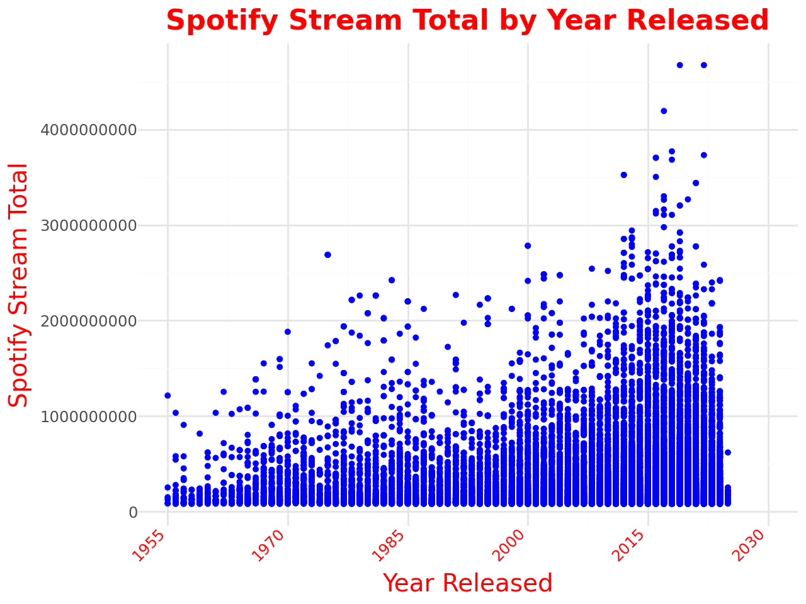

# Project3

## **Table of Contents**

- [Project3](#project3)
  - [**Table of Contents**](#table-of-contents)
  - [**Project Overview**](#project-overview)
  - [**Features**](#features)
  - [**Technologies / Dependencies Needed and Used**](#technologies--dependencies-needed-and-used)
  - [**How to Run the Application**](#how-to-run-the-application)
  - [**Visualizations**](#visualizations)
  - [**Visualization Details**](#visualization-details)
  - [**Visualization Details**](#visualization-details-1)
  - [**Data Source**](#data-source)
  - [**Team Responsibilities**](#team-responsibilities)
  - [**Sources**](#sources)
  - [**Additional Information**](#additional-information)
  - [**License**](#license)
  - [**Project By**](#project-by)
  - [**Contact**](#contact)

## **Project Overview**
The aim of our project is to look at the change in popularity of music genres across the years of 2015 to 2024. The data we will be working with is Spotify track streams. We will be looking at the number of total streams a genre has on spotify. To do this we will first divide the tracks into years they were released. We will then get the genre of each track within and divide the tracks into the genre they belong to. Finally we will add all the number of track streams within a given genre and year and compare those to other genres within the same year. 

## **Features**
* Something here
* Something here
* Interactive Map: Something here
* 1. Part 1 of interactive diagram can be found here [Github Pages maybe???](group github page)
* 2. Part 2 of interactive diagram if needed can be found here [Github Pages maybe Part 2](group github page)

## **Technologies / Dependencies Needed and Used**
- **Pandas**: Used for handling and analyzing large datasets, particularly in tabular form (e.g., DataFrames).
- **SQL**: Used for managing and querying relational databases. It allows you to retrieve, update, and manage data stored in a structured format.
- **PostgreSQL**: A relational database management system (RDBMS) used for storing and querying structured data. It provides support for advanced SQL queries and is widely used in production environments for managing databases.
- **re**: The regular expression (regex) library in Python. It provides a way to search for patterns in text, making it useful for text processing and data cleaning tasks.
- **defaultdict**: A subclass of Python's built-in `dict` that provides a default value for missing keys. It helps simplify handling missing keys during data manipulation.
- **tabulate**: A library used for creating well-formatted plain-text tables. It is helpful for presenting data in a readable format when working with outputs from Python scripts.
- **plotnine**: A data visualization library in Python based on the grammar of graphics. It is used for creating static, high-quality plots and charts.
- **nbformat**: A library for reading and writing Jupyter notebook files (`.ipynb`). It is used for programmatically working with Jupyter notebooks, especially for parsing or manipulating notebook content.
* 

## **How to Run the Application**
add here

## **Visualizations**

[Github Pages Interactive map 1](https://miltonluke.github.io/Project3/spotify_stream_total_plot.html)

[Github Pages Interactive plot 1](https://miltonluke.github.io/Project3/12plot_spotify_stream_total_1990_2025.html)

[Github Pages Interactive plot 2](https://miltonluke.github.io/Project3/12plot_spotify_stream_total_2015_2025.html)

## **Visualization Details**
- A drop down that displays a bar graph that lists genre and track plays in a given year.
- A drop down displays a line graph that tracks plays per genre across all the relase years of 2015 to 2024.

## **Visualization Details**
- Spotify info
## **Data Source**
  - Soundcharts 

## **Team Responsibilities**
- Lynn: Working on creating the PowerPoint presentation that will be given to the class.
- Matt: Matt is cleaned up the data from csv file. Using regex to pull out the genre names.
- Dylan: Setting up the sql and postgress for the data. Working on cleaing csv’s.

## **Sources**
* [Soundcharts](https://app.soundcharts.com/app/market/tracks?filters=eyJzIjoiYXVkaWVuY2Uuc3BvdGlmeXxkZXNjfG1vbnRofHRvdGFsIiwiZiI6eyJmYyI6IkFMTF9DT1VOVFJJRVMiLCJmdHNnIjoiQUxMX0dFTlJFUyJ9LCJtaSI6W119)
*
*
* [ggplot](https://realpython.com/ggplot-python/)

## **Additional Information**
* Initial Data Cleaning......
* Regex to filter Genres & to lower().......
* document
* document
* document
* document

## **License**
This project is licensed under the [GNU GENERAL PUBLIC LICENSE Version 3, 29 June 2007](./LICENSE) - see the LICENSE file for details here.

## **Project By**
**Connor Casey** 
**Dylan M** 
**Luke Milton** 
**Lynn Soors** 
**Matthew Matti**

## **Contact**
For any questions or feedback, feel free to reach out to 

